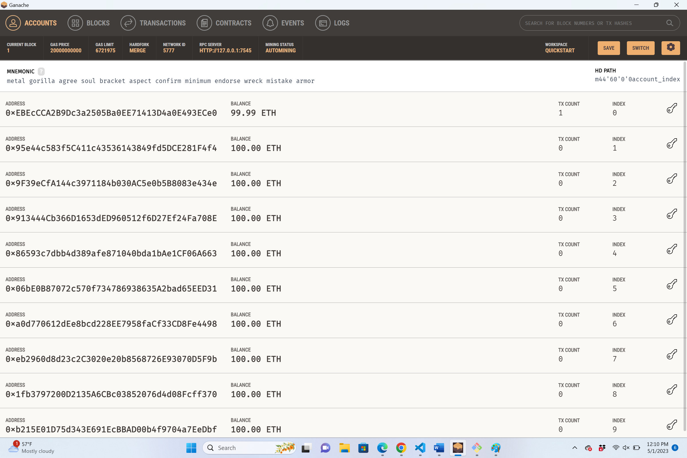
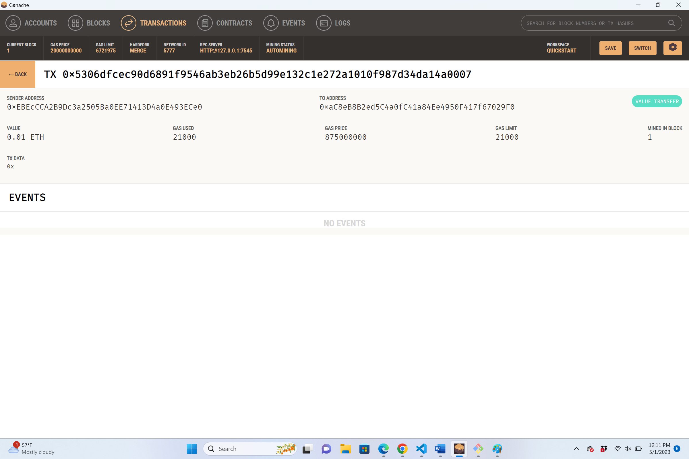

# CU-Fintch202211-FintechFinderBlockChain

This program allows the users to select vendors from a list of fintech professional service providers hire them for select duration and pay them.

---
## Technologies

This program uses the libraries below
a. web3.py for connecting to and performing operations on Ethereum-based blockchains.
b. bip44 for deriving hierarchical deterministic wallets from a seed phrase based on the BIP-44 standard.
c. Ganache to quickly set up a local blockchain, which can be used to test and develop smart contracts.
d. Streamlit for building web interfaces for your Python applications.

---
## Installation Guide

To install `web3`, `bip44`, `streamlit` use the following command in the dev environment activate the dev environment and use the commands below.

```python
pip install web3==5.17
```

```python
pip install bip44
```

```python
pip install streamlit
```
---
## Usage
The application is built of Ganache. Open Ganache application to obtain the mnemonic seed needed to build the HD wallet. Save the mnemonic seed in a .env file in the python working environment.

In order to access the application, run the following command in the development environment

```python
streamlit run fintech_finder.py
```
In the browser based application:

a. Confirm that the Client details align with the Ganache instance account and the balance is updated.

b. Select a Fintech professional from the candidates list and select the desired number of hours.

c. Review the value of the transaction and click 'Send Transaction' to make a payment.

d. Return to Ganache app- Accounts screen and review updated balance

e. Navigate to Ganache app- Transactions screen and review details of the transaction




---

## Contributors


Kunal Srinivasan

---

## License

2022 edX Bootcamps 